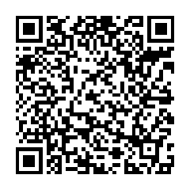

# MoneroBox
MoneroBox aims to be a zero-configuration, plug-and-play Monero full node.  
The box is running on a Single-Board-Computer Rock64 with SSD.  
Users can monitor the box with web browser and use it as a remote node for Monero GUI on destktop / Cake wallet / Monerujo.  
Software such as monero command line tools and web UI will be updated automatically.  

## Features  

* Plug-and-play by utilizing zero-configuration network, user don't need to SSH or anything, just plug the ethernet cable and power cable  
* Monero daemon and web UI are running in docker containers and auto updated via docker hub  
* Web-based monitoring UI  
* Web-based management UI for monero daemon  

## Hardware  

Rock64 + SSD: Rock64 1GB has an ARM 64-bit processor, lower price and USB 3 port! The powerful CPU and SSD enables moenrobox to sync the blockchain from scratch in about 25 hours(depends on network and memory). 

## Software
Monerobox is designed to be easy to use and friendly to beginners. Monitoring and Administration can be done with web UI([RPi-Monitor-Monerobox](https://github.com/Jasonhcwong/RPi-Monitor-Monerobox)) accessed on a mobile phone. Users are recommended to use monerobox as a remote node and connect their mobile wallets to it. Thus coins are stored on the mobile wallets on mobile phones not monerobox so that their fund will be safe even if monerobox is being hacked or destroyed.

## Demo
There is a demo of Monerobox 1 GB model at http://demo.monerobox.store.  
Remote node address: demo.monerobox.store  
Remote node port: 18089  
Remote node username: monero  
Remote node password: monerobox  

## User Manual
User Manual can be found [here](https://github.com/Jasonhcwong/monerobox/wiki/Monerobox-User-Manual) in the wiki.

## TODO  
* [x] Containerization  
* [x] March hard fork  
* [x] Tor support  
* [x] Tor hidden service for remote node  
* [ ] Light wallet server

## Support
* Buy a [Monero sticker](https://monerobox.store/product/monero-sticker/)
* Buy a [Monerobox](https://monerobox.store)
* Donation: 44QnYSXPtbrcJAkG3RZmpxFhrnPKhmvFcDYP5EPDuJx3D816VBnenQTfAnra8NDGo2Qj6dokRZMzUMm7e9CQfFTKCzbNCgH  
  

## Credit
Monerobox is developed based many other open-source software including:  
* [Monero CLI tools by Monero project](https://github.com/monero-project/monero)
* [RPI-Monitor by Xavier Berger](https://github.com/XavierBerger/RPi-Monitor)
* [Rock64 Linux by ayufan](https://github.com/ayufan-rock64/linux-build)
* [Armbian](https://www.armbian.com/)
